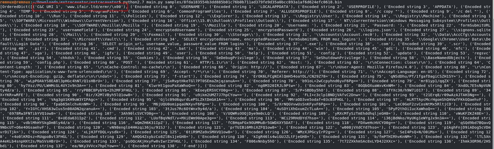

### Installation
```bash
 virtualenv --python=python2 .venvpy2 
 source .venvpy2/bin/activate
 pip2 install -r requirements.txt
```

```bash
 cd extracavator
 python2 main.py <file_path>

 Usage:
    python2 main.py samples/ 587e35d4f7dcfc7db339ff5659ac0630255db304a12d475649b0fc01b68b75c3.bin
```


